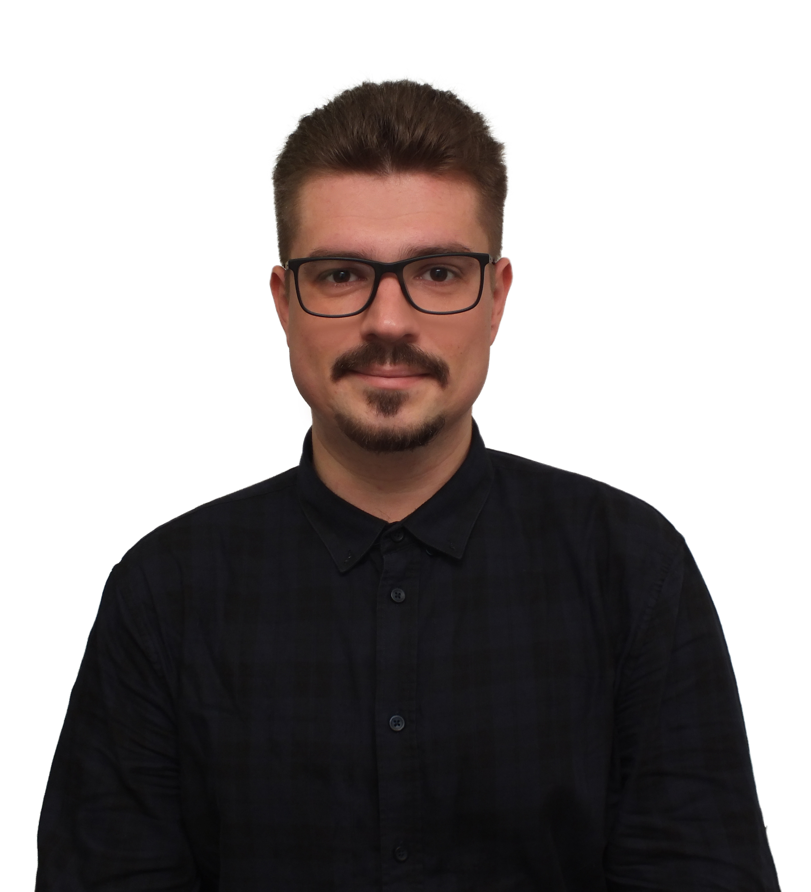

# Vlad Kulyba


## My contact info
* Phone number: +375447609386
* Email: <vladislavkulyba@gmail.com>
* GitHub: [VladKulyba](https://github.com/VladKulyba "Ссылка на GitHub")

## About Me
I am a QA engineer. My work is primarily focused on improving quality of Web application. I have used different test design techniques such as equivalence partitioning, boundary values, all-pairs testing and state-transition diagram to create clearly and easy-understandable test documentation. I have also worked with many useful tools.

## Skills
* Strong experience in manual functional testing
* Performing different test design techniques
* Requirements analysis and clarification
* Experience in testing Windows and Linux desktop applications
* HTML & CSS  


## Code Example
The instruction was next: *"Create a function which allows to split general sentence from question"*  
The solution that I made:
```javascript

const getTypeOfSentece = (sentence) => {
	const lastChar = sentence[sentence.length - 1];
	if (lastChar === '?') {
		return 'question';
	} else if (lastChar === '!') {
		return 'exclamation!';
	} else 
	return 'general';
}

```


## Education
Belarusian State University of Informatics and Radioelectronics  
Faculty of Radioengineering and Electronics  
Specialty: Solid-State Electronics, Radioelectronic Components, Micro- and Nanoelectronics, Quantum Effect Devices  
**Master of Science in Engineering**  

## Languages
* **Russian** (native speaker)
* **English** (intermediate, B1)

